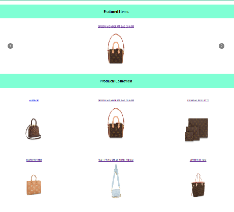

# React e-Shop Website

## Outline

This project is designed to reinforce your React learnings and make sure that you are comfortable with most aspect of the framework. With this project you will practice how to:

-   Fetch Data within a React App
-   Use react-router-dom
-   Use Firebase/Firestore

## Live Image

## MVP

At a minimum your e-shop website should have two pages:

### Home Page

This will contain:

-   A Grid of products
-   Carousel of featured products
-   Product Page (with id parameter) Similar to a product page on another site, allows you to add to cart and select product variants

### All products should be stored in Firestore:

You should store the following information:

-   quantity
-   variants (could be colors, sizes, etc)
-   price per unit
-   name
-   image url
-   favourited or not (boolean) All data should be stored in Firestore and fetched by the frontend, there should be NO static product data in the react application

### Bonus

Using Firestore and react create, a cart system. Create a cart page in your react app. Add logic to prevent users from adding items to cart that are no longer in stock. You will have to check the current cart and the product quantity. Cart page should have the following:

-   List of products in cart

-   Ability to change quantity of products in cart
-   Ability to remove items from cart

### TIPS :

Make sure your site is scoped to one category of products

## Setup

-   Install VS Code for development

-   GitHub setup for adding the project to the repository : Important Commands :

    -   git remote add origin git@github.com:ItiTripathy/portfolio-website.git
    -   git add .
    -   git commit -m "Comment"
    -   git push origin main

-   Creating a React App:

        * Step-1: npx create-react-app my-app
        * Step-2: cd my-app
        * Step-3: npm i sass/npm install node-sass --save
        * Step-4: npm install --save prop-types
        * Step-5: npm install react-router-dom
        * Step-6: npm i firebase
        * Step-7: npm start

-   Setting up Firebase/ Firestore

          * Step-1: Login to Firebase and add a new Project
          * Step-2: Add your React App to the firebase project
          * Step-3: Find the SDK under the project settings and add the key to the ReactApp in the firestore.js file
          * Step-4: Create a new Firestore Collection and add the actual data to be displayed on the App carousel and grid as Documents with different fileds.

## Implementation

-   The e-Shop website fetches data from Firestore Database and displays the items in the form of a Carousel and also a grid format.

-   The Website is developed using React and has the following pages/Containers: Home/Landing page, Shop page which contains Carousel and the Grid and the Shopping Cart page.

-   The Grid Container has the following Components: A Card component which displays the details about a specific item that the user clicks on & a "Add to Cart" button.

-   The "Add to Cart" button adds the item to the cart and redirects the user to the Shopping Cart page.

-   The user can add to/ delete from the Shopping Cart which is connected to a Cart-Collection on the Firestore Database.

-   We implement the CRUD principles and manipulate data of a Database by creating an app using React, JSX, Asynchronous programming, Javascript, SASS and HTML.

## Known Issues

-   The carousel flickers once on load. To be investigated further and fixed.

## Future goals / changes

-   Update the background image on the Home page with an HD image.

## Issues/Roadblocks faced

-   The carousel was not displaying correctly. The issue was fixed by reducing the number of items to display at once to 1.

## Contribution

-   The carousel was developed using "https://www.npmjs.com/package/react-multi-carousel"

-   npm install react-multi-carousel --save
-   import Carousel from 'react-multi-carousel';
-   import 'react-multi-carousel/lib/styles.css';
